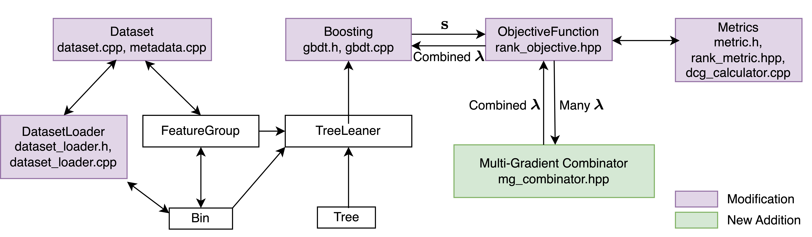

# Multi-Label Learning to Rank through Multi-objective Optimization with LightGBM

## Introduction
MO-LightGBM is a gradient boosting framework based on decision tree algorithms, used for multi-label learning to rank tasks. It is based on [LightGBM](https://github.com/microsoft/LightGBM).



## Installation
1. Install blas and lapack, 
    1. In mac:
       ```
       $brew install openblas
       $brew install lapack
       ```
    2. In Debian-based systems like Ubuntu:
       ```
       $sudo apt install libblas-dev liblapack-dev
       ```
    3. In Red Hat systems like CentOS and Fedora:
       ```
       $sudo yum install lapack-devel blas-devel
       ```

2. From the scs root, build the package, install cmake if needed
   
    ```
    cd LightGBM/external_libs/scs/
    rm -r build
    mkdir build
    cd build
    cmake ..
    make -j$(nproc)
    cd ../../../../
    ```
4. From the ecos root, build the package
   
    ```
    cd LightGBM/external_libs/ecos.2.0.8/
    rm -r build
    mkdir build
    cd build
    cmake ..
    make -j$(nproc)
    cd ../../../../
    ```
5. Now build LightGBM
   
   ```
   cd LightGBM
   rm -r build
   mkdir build
   cd build
   cmake ..
   make -j$(nproc)
   cd ../../
   ```
## Usage
### Assumptions about Dataset
1. The dataset should be in csv or tsv format, not in the libsvm format. 
2. The csv/tsv file should have header that names each column


### Process for bi-objective experiments
1. Prepare the `<dataset_name>_config.yml`
2. Generate configure files for baseline experiment

   `python baselines.py <dataset_name>_config.yml`
3. Go to the `baseline_results` folder and run the experiments

   ```
   cd results_${dataset}/lambdarank/baseline_results
   sh run_experiment.sh
   ```
4. Generate configure files for biobjective experiments for preference based methods

   `python biobjectives.py <dataset_name>_config.yml`
5. Go to the `biobjective_results` folder, and, either run all the experiments or run for individual combinator

   ```
   cd results_${dataset}/lambdarank/biobjective_results
   sh run_experiment.sh   # will run for the all combinators
   sh epo_search_run_experiment.sh     # will run only for epo_search  
   ```
6. Generate configure files for biobjective experiments for constraints based methods

   `python biobjectives_ec.py <dataset_name>_config.yml`
7. Go to the `biobjective_results` folder, and, either run all the experiments or run for individual combinator

   ```
   cd results_${dataset}/lambdarank/biobjective_results
   sh ec_run_experiment.sh   # will run for the all combinators
8. [optional] Run plotting script
   1. Plot bound and ray in one figure
       ```
      python plot_biobjectives.py <dataset_name>_config.yml
       ```

[//]: # (   2. Plot only ray)

[//]: # (       ```)

[//]: # (        python plot_biobjectives_results.py <dataset_name>_config.yml)

[//]: # (       ```)

[//]: # (   3. Plot only bound)

[//]: # (       ```)

[//]: # (       python plot_biobjectives_ec.py <dataset_name>_config.yml)

[//]: # (       ```)

### Example for bi-objective experiment 

```

dataset=istella

root=/home/user/MO-LightGBM/

folder=${root}/example/

cd ${folder}

python baselines.py ${dataset}_config.yml

cd results_${dataset}/lambdarank/baseline_results

sh run_experiment.sh

cd ${folder}


python biobjectives.py ${dataset}_config.yml

cd results_${dataset}/lambdarank/biobjective_results

sh run_experiment.sh 

cd ${folder}


python biobjectives_ec.py ${dataset}_config.yml

cd results_${dataset}/lambdarank/biobjective_results

sh ec_run_experiment.sh 

cd ${folder}


python plot_biobjectives.py ${dataset}_config.yml

```

[//]: # (### Example for tri-objective experiment )

[//]: # ()
[//]: # (```)

[//]: # (python baselines.py ${dataset}_config.yml)

[//]: # ()
[//]: # (cd results_${dataset}/lambdarank/baseline_results)

[//]: # ()
[//]: # (sh run_experiment.sh)

[//]: # ()
[//]: # (cd ${folder})

[//]: # ()
[//]: # ()
[//]: # (python triobjectives.py ${dataset}_config.yml)

[//]: # ()
[//]: # (cd results_${dataset}/lambdarank/triobjective_results)

[//]: # ()
[//]: # (sh run_experiment.sh )

[//]: # ()
[//]: # (cd ${folder})

[//]: # ()
[//]: # ()
[//]: # (python triobjectives_ec.py ${dataset}_config.yml)

[//]: # ()
[//]: # (cd results_${dataset}/lambdarank/triobjective_results)

[//]: # ()
[//]: # (sh ec_run_experiment.sh )

[//]: # ()
[//]: # (cd ${folder})

[//]: # ()
[//]: # (```)

## Citation 
If you use this work, please consider citing the papers:

[Multi-Label Learning to Rank through Multi-Objective
Optimization](https://dl.acm.org/doi/pdf/10.1145/3580305.3599870)

```
@article{chaoshengmo-lightgbm2025,
  title={MO-LightGBM: A Library for Multi-objective Learning to Rank with LightGBM},
  author={Dong, Chaosheng and Momma, Michinari},
  year={2025}
}

@inproceedings{mahapatra2023multi,
  title={Multi-label learning to rank through multi-objective optimization},
  author={Mahapatra, Debabrata and Dong, Chaosheng and Chen, Yetian and Momma, Michinari},
  booktitle={Proceedings of the 29th ACM SIGKDD Conference on Knowledge Discovery and Data Mining},
  year={2023}
}

```

## Security

See [CONTRIBUTING](CONTRIBUTING.md#security-issue-notifications) for more information.

## License

This project is licensed under the Apache-2.0 License.

